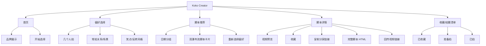
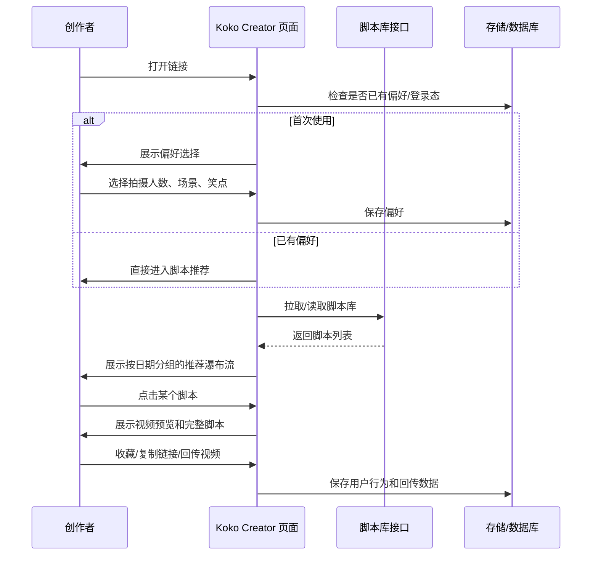
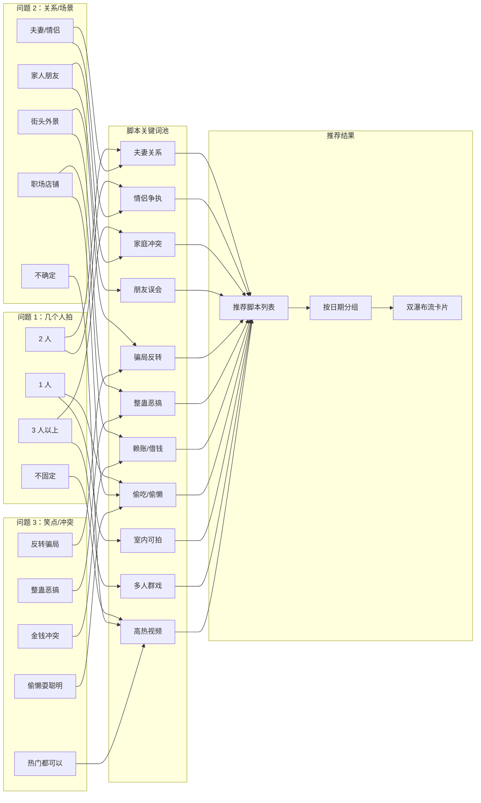
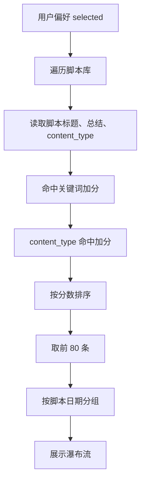
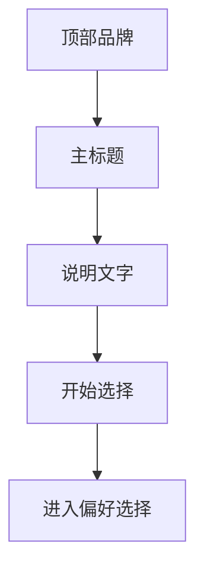
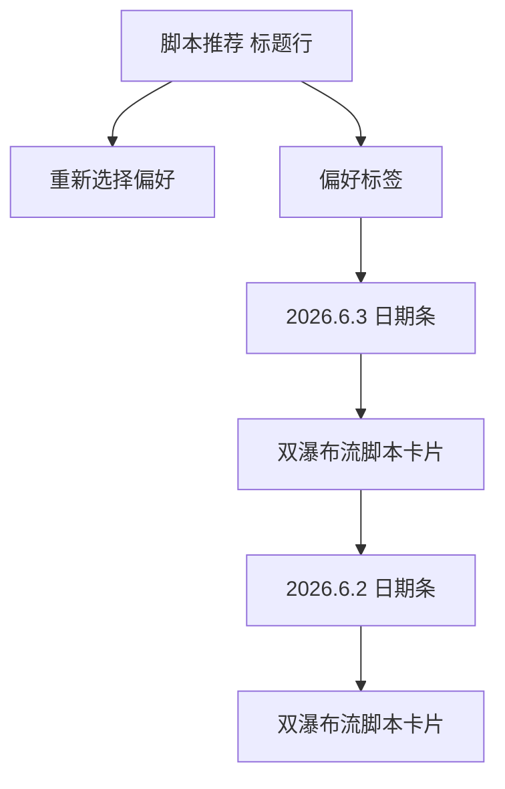
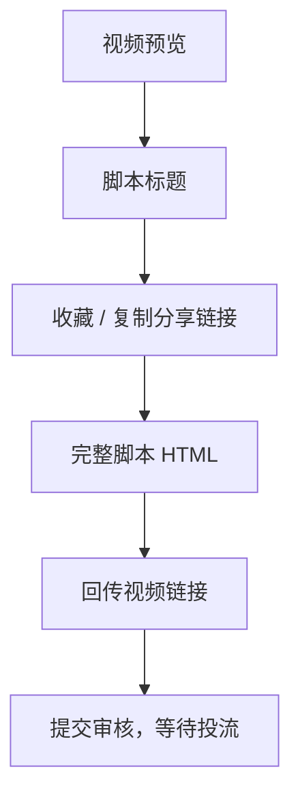
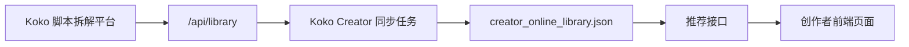
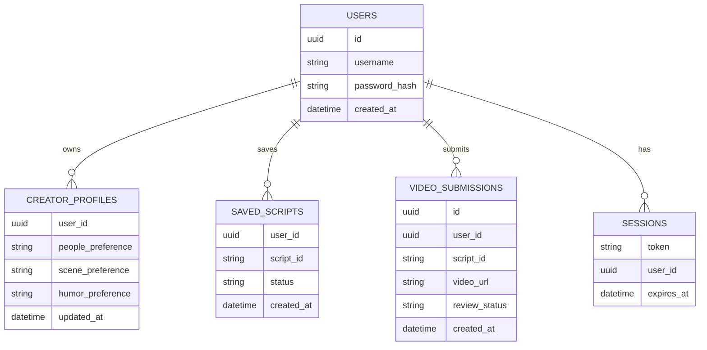

# Koko Creator PRD

版本：v0.1  
日期：2026-06-03  
产品定位：面向巴西短视频创作者的脚本推荐与拍摄回传平台

## 1. 产品一句话

Koko Creator 是一个给创作者使用的脚本推荐平台。创作者首次进入后完成 3 个简单偏好选择，系统记住他的创作类型，之后每次打开都直接进入“脚本推荐”页面，按日期浏览适合自己拍摄的脚本，点开后可看视频预览、完整脚本、收藏脚本、复制分享链接，并回传按脚本拍摄的视频链接。

## 2. 背景与目标

### 背景

现有 Koko 脚本拆解平台更偏内部脚本库与分析工具，创作者直接使用时门槛较高。创作者真正需要的是：

- 快速找到自己能拍的脚本
- 按自己的演员人数、拍摄关系、笑点风格获得推荐
- 每天打开就能看新的可拍内容
- 点开脚本后能直接看视频参考和完整拍摄脚本
- 拍完后能回传链接，等待审核和投流

### 目标

1. 把现有脚本库做成创作者友好的对外呈现页面。
2. 让创作者只选择一次偏好，之后默认进入自己的脚本推荐。
3. 用手机端优先的方式呈现瀑布流脚本库。
4. 支持完整脚本详情、视频预览、收藏、分享链接、视频回传。
5. 后续支持账号密码注册，让不同创作者拥有独立空间。

## 3. 目标用户

| 用户 | 典型状态 | 核心需求 |
| --- | --- | --- |
| 巴西短视频创作者 | 有固定拍摄搭档或家庭成员 | 每天找可拍脚本 |
| MCN/运营人员 | 需要给创作者分发脚本 | 快速筛选、审核回传 |
| Koko 内部团队 | 维护脚本库和投流流程 | 看到回传视频和用户偏好 |

## 4. 当前产品范围

### 已有能力

- 首页展示与入口
- 3 步偏好选择
- 偏好保存在本地浏览器
- 推荐脚本瀑布流
- 按日期分组展示脚本
- 脚本详情页
- 视频预览
- 完整 HTML 脚本展示
- 收藏/拍摄状态，本地保存
- 复制脚本分享链接
- 回传拍摄视频链接
- 每 24 小时从 Koko 脚本库同步一次数据

### 暂未正式完成

- 注册/登录
- 服务端用户空间
- 数据库持久化用户偏好、收藏、回传
- 后台审核台
- 邀请码管理
- WhatsApp / Telegram 分发入口优化

## 5. 产品信息架构

## 6. 用户核心流程

## 7. 偏好选择设计

### 选择问题

| 步骤 | 问题 | 选项 | 设计原因 |
| --- | --- | --- | --- |
| 1 | 你们通常几个人拍？ | 1 人 / 2 人 / 3 人以上 / 不固定 | 创作者通常先知道自己有几个人能出镜 |
| 2 | 你最常拍哪种关系/场景？ | 夫妻/情侣 / 家人朋友 / 街头外景 / 职场店铺 / 不确定 | 比“内容类型”更贴近创作者语言 |
| 3 | 你想要哪种笑点？ | 反转骗局 / 整蛊恶搞 / 金钱冲突 / 偷懒耍聪明 / 热门都可以 | 对应脚本库的可筛选主题 |

## 8. 匹配逻辑

### 匹配原则

系统不是让创作者理解“内容分类”，而是把创作者的自然回答映射成脚本关键词，再用这些关键词给脚本打分。

匹配分三层：

1. **拍摄条件**：几个人、是否适合室内、是否适合家庭/情侣。
2. **内容关系**：夫妻、朋友、家人、职场、陌生人。
3. **戏剧钩子**：骗局、反转、整蛊、赖账、偷懒、金钱冲突。

### 偏好到关键词连线图

### 当前推荐打分逻辑

### 关键词映射表

| 用户选择 | 推荐关键词 | 命中的脚本类型 |
| --- | --- | --- |
| 夫妻/情侣 | 夫妻、老婆、老公、情侣、男友、女友 | 夫妻关系、情侣争执、家庭反转 |
| 整蛊恶搞 | 整蛊、恶作剧、 prank、吓、骗 | 整蛊、玩笑、误会 |
| 骗局反转 | 骗、反转、真相、秘密、误会 | 骗局反转、身份反转 |
| 金钱冲突 | 钱、借钱、欠钱、还钱、pix、买单 | 赖账、消费冲突、家庭财务 |
| 偷吃/偷懒/耍聪明 | 偷吃、懒、酒、装病、藏、逃避 | 偷懒、耍小聪明、夫妻斗智 |
| 热门都可以 | 高分、近期、热门、保存时间新 | 默认热门推荐 |

## 9. 页面设计说明

### 9.1 首页

目的：让创作者知道这是 Koko Creator 的脚本推荐入口。

核心组件：

- Koko / Kwai 品牌区
- 主标题：找到你真的能拍的脚本
- 开始选择按钮
- 手机端视觉图形/吉祥物

### 9.2 偏好选择页

目的：让创作者用最少步骤得到适合自己的脚本推荐。

核心组件：

- 第 1 / 3、2 / 3、3 / 3 步骤条
- 步骤数字可点击
- 上一步 / 下一步
- 选项按钮

### 9.3 脚本推荐页

目的：成为创作者每天打开的“脚本库首页”。

核心组件：

- 标题：脚本推荐
- 重新选择偏好
- 当前偏好标签
- 日期条
- 双瀑布流脚本卡片

### 9.4 脚本详情页

目的：让创作者点开后可以直接判断能不能拍。

核心组件：

- 视频预览
- 标题
- 收藏
- 复制分享链接
- 分享链接展示
- 完整 HTML 脚本
- 回传视频链接

## 10. 数据来源与同步

### 当前数据链路

### 当前机制

- 默认来源：`https://koko-kwai-coach.onrender.com/api/library`
- 同步频率：每 24 小时
- 本地缓存：`DATA_DIR/creator_online_library.json`
- 兜底 seed：仓库 `data/creator_online_library.json`
- 脚本 HTML：首次打开详情时抓取并缓存

## 11. 注册与数据存储规划

### 当前状态

当前偏好、收藏、拍摄状态主要存在浏览器 localStorage；回传视频存在服务端 JSON 文件。

### 目标状态

引入账号密码注册 + PostgreSQL 数据库。

### 注册 MVP

建议第一版：

- 账号
- 密码
- 邀请码
- 不做短信验证码
- 不强制邮箱

原因：

- 巴西创作者分发通常可通过 WhatsApp 定向给链接和邀请码
- 比短信验证码成本低
- 比邮箱验证阻力小
- 能快速实现“每个创作者一个空间”

## 12. 关键接口规划

| 接口 | 方法 | 说明 |
| --- | --- | --- |
| `/api/auth/register` | POST | 注册账号 |
| `/api/auth/login` | POST | 登录 |
| `/api/auth/logout` | POST | 退出 |
| `/api/me` | GET | 获取当前用户 |
| `/api/me/profile` | GET/POST | 获取/保存偏好 |
| `/api/creator/recommendations` | GET | 获取推荐脚本 |
| `/api/scripts/:id` | GET | 获取脚本详情 |
| `/api/me/saved-scripts` | GET/POST | 收藏/状态管理 |
| `/api/creator/submissions` | POST | 回传视频 |
| `/api/admin/submissions` | GET | 后台查看回传 |

## 13. 成功指标

| 指标 | 目标 |
| --- | --- |
| 首次偏好完成率 | > 70% |
| 脚本卡片点击率 | > 25% |
| 收藏率 | > 10% |
| 回传率 | > 3% |
| 次日返回率 | > 20% |
| 推荐页加载时间 | < 2 秒 |
| 详情首屏加载时间 | < 2 秒 |

## 14. 后续迭代

### P0

- 注册/登录
- PostgreSQL 数据库
- 用户偏好服务端保存
- 收藏和回传服务端保存
- 邀请码

### P1

- 后台审核回传视频
- 按创作者查看收藏和回传
- 推荐算法后台配置
- 手动触发脚本库同步

### P2

- WhatsApp 分发短链
- Telegram Mini App
- 创作者表现数据
- 脚本拍摄任务
- 投流状态反馈

## 15. 风险与注意事项

| 风险 | 说明 | 应对 |
| --- | --- | --- |
| 视频外链不可嵌入 | Kwai 等平台可能限制 iframe 或直链 | 保留封面、外链 fallback |
| 内置浏览器剪贴板受限 | WhatsApp/微信/Telegram 内置浏览器可能限制复制 | 点击后直接展示分享链接 |
| 数据不同步 | 当前 24 小时同步不是实时 | 增加手动同步或缩短同步间隔 |
| 无登录导致数据丢失 | localStorage 换设备会丢 | 引入账号系统 |
| 脚本质量不均 | 只靠关键词可能推荐不准 | 增加人工标签和权重配置 |

